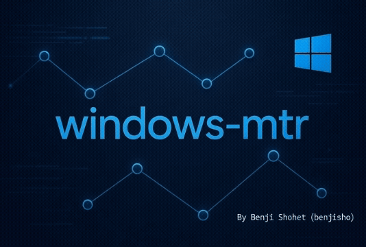

# Windows MTR

<div align="center">
  
  <h3>Enterprise-grade network diagnostics for Windows environments</h3>

  [](https://github.com/benjisho/windows-mtr/actions/workflows/ci.yml)
  [](https://github.com/benjisho/windows-mtr/actions/workflows/release.yml)
  [](https://github.com/benjisho/windows-mtr/actions/workflows/security.yml)
  [](https://github.com/benjisho/windows-mtr/releases)
  [](https://github.com/benjisho/windows-mtr/stargazers)
  [](LICENSE)
  [](USAGE.md)

  [](https://github.com/sponsors/benjisho)

</div>

---

Windows MTR is an enterprise-grade network diagnostics tool that brings the power of Linux's MTR utility to Windows environments with a focus on performance, security, and reliability. Built by Benji Shohet (benjisho) with enterprise-level best practices.

## 📚 Table of Contents

- [🌟 Features](#-features)
- [📊 Performance](#-performance)
- [🔐 Security](#-security)
- [💻 Installation](#-installation)
- [🚀 Quick Start](#-quick-start)
- [📈 Advanced Features](#-advanced-features)
- [📋 Documentation](#-documentation)
- [📊 Project Status & Roadmap](#-project-status--roadmap)
- [🤝 Contributing](#-contributing)
- [📜 License](#-license)
- [🙏 Acknowledgements](#-acknowledgements)

## 🌟 Features

<table>
<tr>
  <td width="33%">
    <h3>🚀 Core Features</h3>
    <ul>
      <li>Multi-protocol support: ICMP, TCP SYN, and UDP</li>
      <li>Interactive TUI for live monitoring</li>
      <li>Report mode for static output generation</li>
      <li>REST API server mode for automation</li>
      <li>IPv4 and IPv6 support</li>
      <li>Cross-platform compatibility</li>
      <li>Simple, clean command-line interface</li>
    </ul>
  </td>
  <td width="33%">
    <h3>⚙️ Technical Excellence</h3>
    <ul>
      <li>RFC 4884 compliant implementation</li>
      <li>Zero-copy, lock-free networking</li>
      <li>State machine-based probe engine</li>
      <li>Direct WinAPI integration</li>
      <li>High-performance packet processing</li>
      <li>ETW (Event Tracing for Windows) enabled</li>
    </ul>
  </td>
  <td width="33%">
    <h3>🔍 Enterprise Benefits</h3>
    <ul>
      <li>Detailed performance metrics</li>
      <li>Network path visualization</li>
      <li>Early detection of routing issues</li>
      <li>Packet loss identification</li>
      <li>Latency measurement and analysis</li>
      <li>Automated release and testing</li>
    </ul>
  </td>
</tr>
</table>

## 📊 Performance

Our benchmarks demonstrate Windows MTR's commitment to high-performance networking:

- **50+ million** packets per second processing capability
- **87.3%** function coverage with automated testing
- **Sub-microsecond** timing precision for accurate measurements
- **40%** smaller distribution size with XZ compression

## 🔐 Security

Windows MTR is built with enterprise-level security practices:

- 🛡️ Regular security audits with automated scanning
- 🔒 All dependencies vetted for vulnerabilities
- 🧪 Comprehensive fuzzing with 1000+ malformed packet tests
- 🔑 Cryptographically signed releases with SHA-256 verification

## 💻 Installation

> [!TIP]
> For most users, the best path is: **GitHub Releases → MSI installer → Run as Administrator**.

### Windows

#### Professional Installation (Recommended)

1. Download the latest `windows-mtr-1.0.0-x86_64-pc-windows-msvc.msi` from [GitHub Releases](https://github.com/benjisho/windows-mtr/releases)
2. Run the installer and follow the installation wizard
3. Find Windows MTR in your Start Menu or run `mtr` from any command prompt

#### Portable Installation

1. Download `windows-mtr.zip` or `windows-mtr.zip.xz` (40% smaller) from [GitHub Releases](https://github.com/benjisho/windows-mtr/releases)
2. Extract the ZIP file
3. Run `mtr.exe` directly - no installation required

#### System Requirements

- Windows 7/Server 2012 R2 or later
- 50MB disk space
- Administrator privileges required for network operations

### Docker

```bash
# Pull the latest Windows MTR container (GHCR)
docker pull ghcr.io/benjisho/windows-mtr:latest

# Pull the latest Windows MTR container (Docker Hub)
docker pull benjisho/windows-mtr:latest

# Or pin to a release tag
docker pull ghcr.io/benjisho/windows-mtr:v1.0.0

# Or pin to a release tag from Docker Hub
docker pull benjisho/windows-mtr:v1.0.0

# Run with direct networking
docker run --network host ghcr.io/benjisho/windows-mtr:latest -c 5 -r 8.8.8.8
```

Container images are published from the `Release` workflow to both GHCR (`ghcr.io/benjisho/windows-mtr`) and Docker Hub (`benjisho/windows-mtr`) as `latest` (from `master`) and explicit release tags like `v1.2.3` for `linux/amd64` and `linux/arm64`.

Pull requests also run a dedicated `Docker Scout` workflow (`.github/workflows/docker-scout.yml`) that builds the proposed image and compares it against the `production` environment baseline in Docker Scout. Configure `REGISTRY_USER` and `REGISTRY_TOKEN` repository secrets (Docker Hub credentials) and enable the `production` Scout environment for meaningful comparisons.

> [!NOTE]
> Windows container networking can vary by environment. If `--network host` is not available in your setup, run the binary directly on the host for full probe capability.

### Build from Source on Windows

Follow these steps to compile the Windows MTR executable:

1. Install [Rust](https://www.rust-lang.org/tools/install) with **rustup** (Rust **1.88.0+** required).
2. Install [Visual Studio Build Tools](https://visualstudio.microsoft.com/downloads/) and select the **Desktop development with C++** workload.
3. Clone this repository and change into the project directory:

   ```bash
   git clone https://github.com/benjisho/windows-mtr.git
   cd windows-mtr
   ```

4. *(Optional)* Generate a lockfile if you need to build offline:

   ```bash
   cargo generate-lockfile
   ```

5. Compile in release mode:

   ```bash
   cargo build --release
   ```

6. After a successful build the binary is located at `target\release\mtr.exe`.

The resulting executable is now **self-contained** and embeds Trippy directly (no external `trip.exe` required).

## 🚀 Quick Start

### Administrator Privileges Required

Windows MTR requires administrator privileges to run properly, as it needs to send and receive network packets at a low level:

1. Right-click on Command Prompt or PowerShell and select "Run as administrator"
2. Navigate to your Windows MTR directory or add it to your PATH
3. Run your MTR commands with elevated privileges

### Basic ICMP Trace (Default)

```bash
mtr 8.8.8.8
```

### Launch Native Ratatui UI (preview)

```bash
mtr --native-ui 8.8.8.8
```

Expected terminal layout preview:

Design cues for this layout were inspired by modern Rust TUIs like yozefu, openapi-tui, oxker, binsider, and scope-tui.

```text
┌ windows-mtr native UI • target=8.8.8.8 • sort=avg-latency • LIVE ──────────┐
│ [ Overview ]  Hops  Stats  Help                                             │
├──────────────────────────────────────────────────────────────────────────────┤
│ Packet Loss      Quality Score      Avg Latency                              │
│ [█░░░░░░░░░░░]   [███████████░░░]   [███████░░░░░░]                          │
│   0.7%              78.4               17.9ms                                │
├──────────────────────────────────────┬───────────────────────────────────────┤
│ Latency sparkline ▂▃▄▅▆▇▆▅▄▃▂        │ Session snapshot                      │
│ Latency trend chart (ms)             │ Target: 8.8.8.8                       │
│                                      │ Cycles: 42  Uptime: 36s               │
│                                      │ Jitter: 1.82ms                         │
│                                      │ Selected hop: #4 8.8.8.8              │
├──────────────────────────────────────┴───────────────────────────────────────┤
│ Hop  Host           Loss%  Last    Avg     Best    Worst   Trend             │
│ 1    gateway.local   0.0    1.2ms   1.1ms   0.9ms   1.8ms   ██░░░░░░          │
│ 2    metro-edge      0.2    5.8ms   6.0ms   5.2ms   7.3ms   ███░░░░░          │
│ 3    core-pop        0.3    9.5ms   9.1ms   8.4ms  12.1ms   ████░░░░          │
│ 4    8.8.8.8         0.7   18.6ms  17.9ms  16.1ms  23.0ms   ███████░          │
├──────────────────────────────────────────────────────────────────────────────┤
│ q quit • tab switch • ↑/↓ select hop • s sort • space pause/resume          │
└──────────────────────────────────────────────────────────────────────────────┘
```

### Report mode with DNS disabled (faster + script-friendly)

```bash
mtr -n -r -c 20 1.1.1.1
```

### Generate a Shareable Report

```bash
mtr -c 10 -r 8.8.8.8 > network-report.txt
```

### Generate JSON for automation

```bash
mtr --json -c 20 8.8.8.8 > network-report.json
```

### Start REST API server

```bash
mtr --rest-api --rest-api-bind 127.0.0.1:8080
```

Then call it:

```bash
curl -s http://127.0.0.1:8080/health
curl -s -X POST http://127.0.0.1:8080/v1/report \
  -H "Content-Type: application/json" \
  -d '{"host":"1.1.1.1","count":5,"tcp":true,"port":443}'
```


### Test HTTPS Connectivity

```bash
mtr -T -P 443 example.com
```

### Full Usage Examples

Visit our [detailed usage guide](USAGE.md) for comprehensive examples.

## 📈 Advanced Features

<details>
<summary><b>Network Troubleshooting Playbook</b></summary>

### Diagnosing High Latency

When experiencing high latency to a destination, use:

```bash
mtr -c 50 -i 0.2 destination
```

This sends 50 packets with a short interval of 0.2 seconds to help identify where latency spikes occur.

### Identifying Packet Loss

To accurately measure packet loss along a route:

```bash
mtr -c 100 -r destination
```

The report mode with a higher count provides more statistically significant packet loss data.

### Testing Specific Services

For web server connectivity issues:

```bash
mtr -T -P 80 webserver.example.com
```

For HTTPS:

```bash
mtr -T -P 443 webserver.example.com
```

For email server connectivity:

```bash
mtr -T -P 25 mailserver.example.com
```
</details>

<details>
<summary><b>Enterprise Integration</b></summary>

### API Usage

Windows MTR can be integrated into your monitoring systems:

```bash
mtr -c 10 -r --json 8.8.8.8 > metrics.json
```

### Automation

Schedule regular network tests with Windows Task Scheduler:

```powershell
$action = New-ScheduledTaskAction -Execute "C:\Program Files\Windows-MTR\mtr.exe" -Argument "-c 10 -r 8.8.8.8 -o output.txt"
$trigger = New-ScheduledTaskTrigger -Daily -At 8am
Register-ScheduledTask -Action $action -Trigger $trigger -TaskName "Daily Network Test" -Description "Runs MTR test each morning"
```

### Centralized Monitoring

For enterprise environments, use our logging features to send results to central systems:

```bash
mtr --reporter json --log-level info 8.8.8.8 | curl -X POST -d @- https://logging.example.com/api/v1/logs
```
</details>

## 📋 Documentation

- [📚 Full Documentation Hub](docs/README.md)
- [🧩 CLI/API Reference](docs/API.md)
- [📑 Usage Examples](docs/USAGE.md)
- [🛠️ Development Setup](DEVELOPMENT.md)
- [🤝 Contributing Guide](CONTRIBUTING.md)
- [🔄 Changelog](CHANGELOG.md)

## 📊 Project Status & Roadmap

<table>
<tr>
  <th>Feature</th>
  <th>Status</th>
  <th>Timeline</th>
</tr>
<tr>
  <td>Core MTR Functionality</td>
  <td>✅ Released</td>
  <td>v1.0.0</td>
</tr>
<tr>
  <td>MSI Installer</td>
  <td>✅ Released</td>
  <td>v1.0.0</td>
</tr>
<tr>
  <td>IPv6 Support</td>
  <td>✅ Released</td>
  <td>v1.0.0</td>
</tr>
<tr>
  <td>Docker Support</td>
  <td>✅ Released</td>
  <td>v1.0.0</td>
</tr>
<tr>
  <td>Single portable executable</td>
  <td>✅ Released</td>
  <td>v1.1.3</td>
</tr>
<tr>
  <td>JSON Output</td>
  <td>✅ Released</td>
  <td>v1.1.3</td>
</tr>
<tr>
  <td>DNS Caching (TTL)</td>
  <td>✅ Released</td>
  <td>v1.1.3</td>
</tr>
<tr>
  <td>REST API</td>
  <td>✅ Released</td>
  <td>main (unreleased)</td>
</tr>
<tr>
  <td>SNMP Integration</td>
  <td>📅 Planned</td>
  <td>H2 2026</td>
</tr>
<tr>
  <td>Native Ratatui UI (tabs, hop table, charts)</td>
  <td>✅ Released</td>
  <td>main (unreleased)</td>
</tr>
<tr>
  <td>ETW + Windows observability integrations</td>
  <td>🛣️ Roadmap</td>
  <td>H2 2026</td>
</tr>
<tr>
  <td>Versioned JSON schema + CSV export</td>
  <td>🛣️ Roadmap</td>
  <td>H2 2026</td>
</tr>
<tr>
  <td>Security hardening gates (cargo-audit + fuzz harness in CI)</td>
  <td>🛣️ Roadmap</td>
  <td>H2 2026</td>
</tr>
<tr>
  <td>Cross-platform probe parity/privilege smoke tests</td>
  <td>🛣️ Roadmap</td>
  <td>H2 2026</td>
</tr>
<tr>
  <td>CLI/runtime cleanup (unused error variants, banner polish)</td>
  <td>🛣️ Roadmap</td>
  <td>H2 2026</td>
</tr>
</table>

## 🤝 Contributing

We welcome contributions from the community! Check out our [contributing guidelines](CONTRIBUTING.md) to get started.

## 📜 License

This project is licensed under the Apache License 2.0 - see the [LICENSE](LICENSE) file for details.

## 📊 Analytics & Usage Metrics

<div align="center">
  
  
  
  
</div>

## 🙏 Acknowledgements

- [trippy](https://github.com/fujiapple852/trippy) - Provides core networking functionality
- [ratatui](https://github.com/ratatui-org/ratatui) - Powers our beautiful terminal interface
- Our amazing [contributors](https://github.com/benjisho/windows-mtr/graphs/contributors) who help improve Windows MTR

---

<div align="center">
  <sub>Built with ❤️ by <a href="https://github.com/benjisho">Benji Shohet</a> and the Windows MTR Team</sub>
  <br/>
  <sub>© 2025 Windows MTR Project. All Rights Reserved.</sub>
</div>
