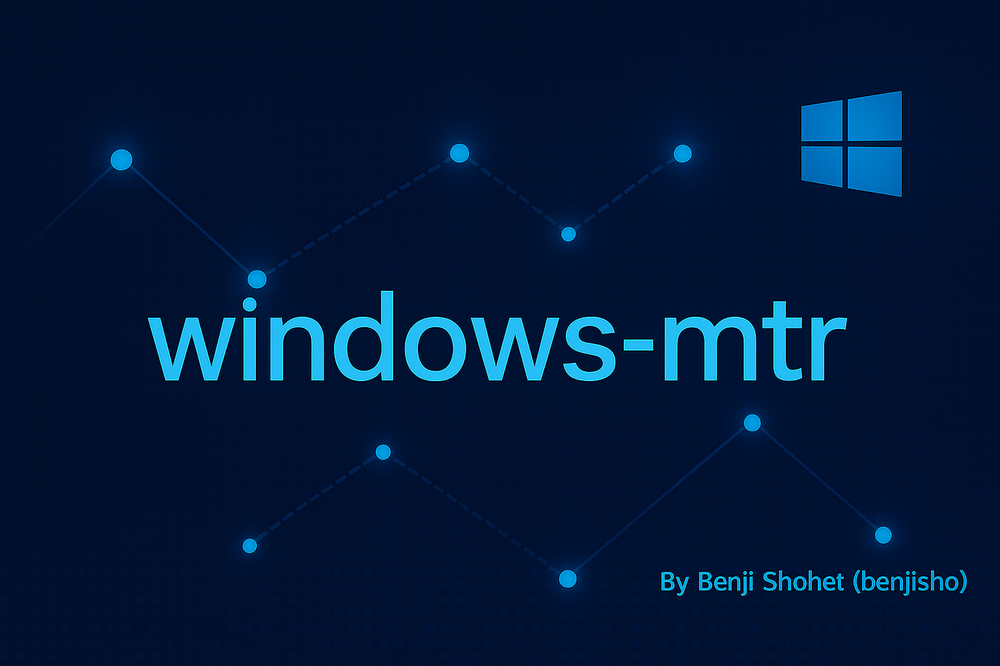

# Windows MTR

A Windows-native clone of Linux MTR — cross-platform Rust CLI that delivers ICMP/TCP/UDP traceroute & ping in a single portable executable (`mtr.exe`). Built by Benji Shohet (benjisho).




## Features

- **Identical to Linux mtr**: Same command-line flags, output formats, and behavior.
- **Cross-platform**: Works on Windows, Linux, and macOS.
- **Multiple protocols**: ICMP (default), TCP SYN, and UDP probing.
- **Rich TUI**: Beautiful terminal interface for live monitoring.
- **Report mode**: Generate static, one-shot reports identical to Linux mtr.
- **Single binary**: Just download and run, no installation required.
- **No admin rights needed on Windows**: Uses Windows ICMP API, no external dependencies like Npcap.
- **RFC 4884 compliant**: Properly implements ICMP extension headers for path MTU discovery.
- **High performance**: Uses zero-copy buffers and lock-free queues for efficient packet processing.
- **Windows optimized**: Direct WinAPI integration via `windows-sys` for native performance.

## Installation

### Windows

#### ZIP Package (Portable)

1. Download the latest `windows-mtr.zip` or `windows-mtr.zip.xz` (40% smaller) from [GitHub Releases](https://github.com/benjisho/windows-mtr/releases).
2. Extract the ZIP file.
3. Use either `mtr.exe` or `windows-mtr.exe` - both are identical.
4. No installation required - just run the executable.

#### MSI Installer

1. Download the latest `windows-mtr-1.0.0-x86_64-pc-windows-msvc.msi` from [GitHub Releases](https://github.com/benjisho/windows-mtr/releases).
2. Run the installer and follow the prompts.
3. After installation, you can run `mtr` from any command prompt or PowerShell window.
4. The MSI installer adds Windows MTR to your PATH and creates Start Menu shortcuts.

### Build from Source

```bash
git clone https://github.com/benjisho/windows-mtr.git
cd windows-mtr
cargo build --release
```

The binary will be available at `target/release/mtr.exe` (Windows) or `target/release/mtr` (Linux/macOS).

To create a distribution package:

```bash
cargo run --package xtask -- dist
```

This will create ZIP and XZ compressed packages in the `dist` directory along with SHA256 checksums.

## Usage Examples

### Basic ICMP Trace (default)

```bash
mtr 8.8.8.8
```

### TCP Mode (e.g., testing HTTPS connectivity)

```bash
mtr -T -P 443 example.com
```

### UDP Mode (e.g., testing DNS connectivity)

```bash
mtr -U -P 53 8.8.8.8
```

### Generate Static Report (10 pings)

```bash
mtr -c 10 -r 8.8.8.8
```

### Set Custom Interval and Timeout

```bash
mtr -i 0.5 -w 2.0 8.8.8.8
```

### Disable DNS Resolution (faster)

```bash
mtr -n 8.8.8.8
```

### Limit Maximum Hops

```bash
mtr -m 15 example.com
```

## Advanced Usage

### Network Troubleshooting Workflows

#### Diagnosing High Latency

When experiencing high latency to a destination, use:

```bash
mtr -c 50 -i 0.2 destination
```

This sends 50 packets with a short interval of 0.2 seconds to help identify where latency spikes occur.

#### Identifying Packet Loss

To accurately measure packet loss along a route:

```bash
mtr -c 100 -r destination
```

The report mode with a higher count provides more statistically significant packet loss data.

#### Testing Specific Services

For web server connectivity issues:

```bash
mtr -T -P 80 webserver.example.com
```

For HTTPS:

```bash
mtr -T -P 443 webserver.example.com
```

For email server connectivity:

```bash
mtr -T -P 25 mailserver.example.com
```

### Output Interpretation

In report mode (`-r`), Windows MTR produces output like:

```bash
HOST: laptop                      Loss%   Snt   Last   Avg  Best  Wrst StDev
  1.|-- router.local               0.0%    10    1.8   1.9   1.7   2.1   0.1
  2.|-- isp-gateway.example.com    0.0%    10   10.2  12.3   9.8  20.1   3.2
  3.|-- core1.isp.example.com      0.0%    10   12.5  13.2  11.9  15.8   1.1
  4.|-- ae-2.r01.example.net       0.0%    10   14.8  15.2  14.0  19.3   1.6
  5.|-- ???                        100.0    10    0.0   0.0   0.0   0.0   0.0
  6.|-- cdn-edge-01.example.com    0.0%    10   19.3  19.5  18.9  21.2   0.6
```

Column explanations:

- **Loss%**: Percentage of packet loss at this hop
- **Snt**: Number of packets sent
- **Last**: Latency of the last packet (ms)
- **Avg**: Average latency (ms)
- **Best**: Best case latency (ms)
- **Wrst**: Worst case latency (ms)
- **StDev**: Standard deviation of latencies (ms)

## Command-line Options

| Option | Description |
|--------|-------------|
| `-T` | Use TCP SYN for probes (default is ICMP) |
| `-U` | Use UDP for probes (default is ICMP) |
| `-P <port>` | Target port for TCP/UDP modes |
| `-r` | Report mode (no continuous updates) |
| `-c <count>` | Number of pings to send to each host |
| `-i <seconds>` | Time between ICMP ECHO requests |
| `-w <seconds>` | Maximum time to keep a probe alive |
| `-n` | Don't perform reverse DNS lookups (faster) |
| `-m <hops>` | Maximum number of hops to probe |

For a complete list, run `mtr --help`.

## Troubleshooting

### Common Issues and Solutions

#### "Trippy binary not found" Error

Windows MTR depends on the trippy binary. If you see this error:

1. Ensure you have internet connectivity (needed to download trippy)
2. Try manually installing trippy: `cargo install trippy`
3. Verify that `~/.cargo/bin` is in your PATH

#### Permission Errors on Windows

While Windows MTR doesn't require administrator rights, you may encounter permission errors if:

1. Your firewall is blocking the application
2. You're running in a restricted environment

Solutions:

- Add an exception in your firewall for `mtr.exe`
- Try running from a command prompt launched with "Run as administrator"

#### High Packet Loss on Certain Hops

Some routers intentionally deprioritize or block ICMP traffic. If you see 100% packet loss at specific hops but traffic flowing afterward, try:

```bash
mtr -T -P 80 destination
```

This uses TCP SYN packets instead of ICMP, which may bypass router restrictions.

#### DNS Resolution Issues

If you experience slow startup times due to DNS resolution:

1. Use the `-n` flag to disable DNS lookups
2. If targeting a domain name with DNS issues, try using the IP address directly

#### Performance Issues on Older Windows Systems

For better performance on older Windows systems:

1. Use report mode (`-r`) instead of the TUI interface
2. Limit the number of pings with `-c`
3. Use longer intervals with `-i 1.0` or higher

### Technical Diagnostics

For deeper troubleshooting, Windows MTR creates log files at:

- Windows: `%LOCALAPPDATA%\windows-mtr\logs\`
- Linux/macOS: `$HOME/.local/share/windows-mtr/logs/`

The log files contain detailed information about packet transmission, reception, and any errors encountered.

## FAQ

### Do I need admin rights to run on Windows?

No, unlike many other network tools, Windows MTR does not require administrator privileges to run. It uses the Windows ICMP API, which is accessible to normal users.

### Do I need to install WinPcap or Npcap?

No, Windows MTR has no external dependencies. It runs as a single executable file.

### Is the output identical to Linux mtr?

Yes, we've taken great care to ensure that the output format, especially in report mode (`-r`), matches the Linux mtr output byte-for-byte.

### Why do I see "???" in the results?

Hops showing "???" with 100% packet loss typically indicate:

1. A firewall or router configured to not respond to ICMP
2. A network device that's dropping or deprioritizing probe packets
3. A hop that's actually failing or experiencing issues

This is normal behavior and doesn't necessarily indicate a problem.

### Is Windows MTR compatible with Windows Server?

Yes, Windows MTR is fully compatible with all Windows versions from Windows 7/Server 2012 R2 through Windows 11/Server 2022.

### Does Windows MTR support IPv6?

Yes, Windows MTR fully supports IPv6 addresses. Simply use an IPv6 address as the target:

```bash
mtr 2001:4860:4860::8888
```

## License

Apache License 2.0 - See [LICENSE](LICENSE) for details.

## Contributing

Contributions are welcome! Please see [CONTRIBUTING.md](CONTRIBUTING.md) for guidelines.

## Version History

For a complete list of changes, see [CHANGELOG.md](CHANGELOG.md).

- **v1.0.0** - Initial stable release with ICMP, TCP, UDP support and MSI installer
- **v0.1.0** - Preview release with core functionality

---

Built with [trippy](https://github.com/fujiapple852/trippy) and [ratatui](https://github.com/ratatui-org/ratatui).
